# 클래스 다이어그램 (Class Diagram)

```mermaid
classDiagram
    class User {
        -String userId
        -String userPw
        -String userName
        -String userAddress
        -String phone
        -String birthDate
        -String hireDate
    }

    class Route {
        -Long route_id
        -String writer
        -String title
        -String route
        -String description
        -LocalDateTime createAt
        -Long liked
        -double distance
        -String location
        -String difficulty
        -String type
    }

    class CrewBoard {
        -Long id
        -String title
        -String content
        -String writerId
        -String region
        -BoardType boardType
        -int recruitCount
        -int currentCount
        -LocalDate deadline
        -String routePathJson
        -LocalDateTime createdAt
    }

    class CrewApplication {
        -Long id
        -String applicantId
        -String applicantName
        -String birthDate
        -String hireDate
        -String phone
        -String userAddress
        -LocalDateTime appliedAt
    }

    class CrewComment {
        -Long id
        -String writerId
        -String content
        -LocalDateTime createdAt
    }

    class RouteComment {
        -Long id
        -String writerId
        -Long routeId
        -String content
        -LocalDateTime createdAt
    }

    class RouteLike {
        -Long id
        -String userId
        -Long routeId
    }

    class RouteDip {
        -Long id
        -String userId
        -Long routeId
        -String record
        -boolean complete
    }

    class BoardType {
        <<enumeration>>
        NORMAL
        FLASH
        DRAWING
    }

    class UserService {
        -UserRepository userRepository
        +getAllUsers() List~User~
        +getUser(String userId) User
        +createUser(User user) User
        +updateUser(String userId, User update) User
        +deleteUser(String userId) void
        +login(String userId, String userPw) User
    }

    class RouteService {
        -RouteRepository routeRepository
        +uploadRoute(Route route) Route
        +getAllRoutes() List~Route~
        +getRouteById(Long id) Route
        +deleteRoute(Long id, String loginUserId) void
    }

    class CrewBoardService {
        -CrewBoardRepository crewBoardRepository
        -CrewApplicationRepository crewApplicationRepository
        -UserService userService
        +createBoard(CrewBoardRequestDTO dto, String writerId) CrewBoard
        +getBoardList(BoardType type) List~CrewBoard~
        +getBoard(Long id) CrewBoard
        +updateBoard(Long id, CrewBoardRequestDTO dto, String loginUserId) CrewBoard
        +deleteBoard(Long id, String loginUserId) void
        +applyToBoard(Long boardId, String loginUserId) CrewApplication
        +getApplications(Long boardId, String loginUserId) List~CrewApplication~
    }

    class UserRepository {
        <<interface>>
        +findAll() List~User~
        +findById(String userId) Optional~User~
        +save(User user) User
        +deleteById(String userId) void
        +existsByUserId(String userId) boolean
        +existsByUserName(String userName) boolean
    }

    class RouteRepository {
        <<interface>>
        +findAll() List~Route~
        +findById(Long id) Optional~Route~
        +save(Route route) Route
        +delete(Route route) void
    }

    class CrewBoardRepository {
        <<interface>>
        +findAll() List~CrewBoard~
        +findById(Long id) Optional~CrewBoard~
        +save(CrewBoard board) CrewBoard
        +delete(CrewBoard board) void
        +findByBoardType(BoardType type) List~CrewBoard~
    }

    class CrewApplicationRepository {
        <<interface>>
        +save(CrewApplication application) CrewApplication
        +findByCrewBoardId(Long boardId) List~CrewApplication~
        +existsByCrewBoardIdAndApplicantId(Long boardId, String applicantId) boolean
    }

    class CrewCommentRepository {
        <<interface>>
        +findAll() List~CrewComment~
        +save(CrewComment comment) CrewComment
        +delete(CrewComment comment) void
    }

    class RouteCommentRepository {
        <<interface>>
        +findAll() List~RouteComment~
        +save(RouteComment comment) RouteComment
        +delete(RouteComment comment) void
    }

    class LikeRepository {
        <<interface>>
        +findAll() List~RouteLike~
        +save(RouteLike like) RouteLike
        +delete(RouteLike like) void
    }

    class DipRepository {
        <<interface>>
        +findAll() List~RouteDip~
        +save(RouteDip dip) RouteDip
        +delete(RouteDip dip) void
    }

    class UserController {
        -UserService userService
        +getAllUsers() ResponseEntity
        +getUser(String userId) ResponseEntity
        +createUser(User user) ResponseEntity
        +updateUser(String userId, User user) ResponseEntity
        +deleteUser(String userId) ResponseEntity
        +login(LoginDTO loginDTO) ResponseEntity
    }

    class RouteController {
        -RouteService routeService
        +uploadRoute(Route route) ResponseEntity
        +getAllRoutes() ResponseEntity
        +getRouteById(Long id) ResponseEntity
        +deleteRoute(Long id) ResponseEntity
    }

    class CrewBoardController {
        -CrewBoardService crewBoardService
        +createBoard(CrewBoardRequestDTO dto) ResponseEntity
        +getBoardList(BoardType type) ResponseEntity
        +getBoard(Long id) ResponseEntity
        +updateBoard(Long id, CrewBoardRequestDTO dto) ResponseEntity
        +deleteBoard(Long id) ResponseEntity
        +applyToBoard(Long boardId) ResponseEntity
        +getApplications(Long boardId) ResponseEntity
    }

    class LikeController {
        -LikeService likeService
        +toggleLike(Long routeId) ResponseEntity
        +getLikeStatus(Long routeId) ResponseEntity
    }

    class DipController {
        -DipService dipService
        +addDip(RouteDipDTO dto) ResponseEntity
        +getDips() ResponseEntity
        +updateDip(Long id, RouteDipDTO dto) ResponseEntity
    }

    %% Relationships
    CrewBoard "1" --> "*" CrewApplication : contains
    CrewBoard "1" --> "*" CrewComment : has
    CrewBoard --> BoardType : uses
    CrewApplication --> CrewBoard : belongs to
    CrewComment --> CrewBoard : belongs to
    RouteComment --> Route : references (via routeId)
    RouteLike --> Route : references (via routeId)
    RouteLike --> User : references (via userId)
    RouteDip --> Route : references (via routeId)
    RouteDip --> User : references (via userId)
    CrewBoard --> User : references (via writerId)
    Route --> User : references (via writer)

    %% Service dependencies
    UserService --> UserRepository : uses
    RouteService --> RouteRepository : uses
    CrewBoardService --> CrewBoardRepository : uses
    CrewBoardService --> CrewApplicationRepository : uses
    CrewBoardService --> UserService : uses

    %% Controller dependencies
    UserController --> UserService : uses
    RouteController --> RouteService : uses
    CrewBoardController --> CrewBoardService : uses
    LikeController --> LikeService : uses
    DipController --> DipService : uses

    %% Repository dependencies
    UserRepository ..> User : manages
    RouteRepository ..> Route : manages
    CrewBoardRepository ..> CrewBoard : manages
    CrewApplicationRepository ..> CrewApplication : manages
    CrewCommentRepository ..> CrewComment : manages
    RouteCommentRepository ..> RouteComment : manages
    LikeRepository ..> RouteLike : manages
    DipRepository ..> RouteDip : manages
```

## 주요 클래스 설명

### 도메인 엔티티 (Domain Entities)
- **User**: 사용자 정보를 담는 엔티티
- **Route**: 러닝 경로 정보를 담는 엔티티
- **CrewBoard**: 크루 모집 게시판 엔티티
- **CrewApplication**: 크루 모집 신청 엔티티
- **CrewComment**: 크루 게시판 댓글 엔티티
- **RouteComment**: 경로 댓글 엔티티
- **RouteLike**: 경로 좋아요 엔티티
- **RouteDip**: 경로 찜하기/기록 엔티티
- **BoardType**: 게시판 유형 열거형 (NORMAL, FLASH, DRAWING)

### 서비스 레이어 (Service Layer)
- **UserService**: 사용자 관련 비즈니스 로직
- **RouteService**: 경로 관련 비즈니스 로직
- **CrewBoardService**: 크루 게시판 관련 비즈니스 로직

### 컨트롤러 레이어 (Controller Layer)
- **UserController**: 사용자 관련 HTTP 요청 처리
- **RouteController**: 경로 관련 HTTP 요청 처리
- **CrewBoardController**: 크루 게시판 관련 HTTP 요청 처리
- **LikeController**: 좋아요 관련 HTTP 요청 처리
- **DipController**: 찜하기 관련 HTTP 요청 처리

### 리포지토리 레이어 (Repository Layer)
- 각 엔티티에 대응하는 JPA Repository 인터페이스들

