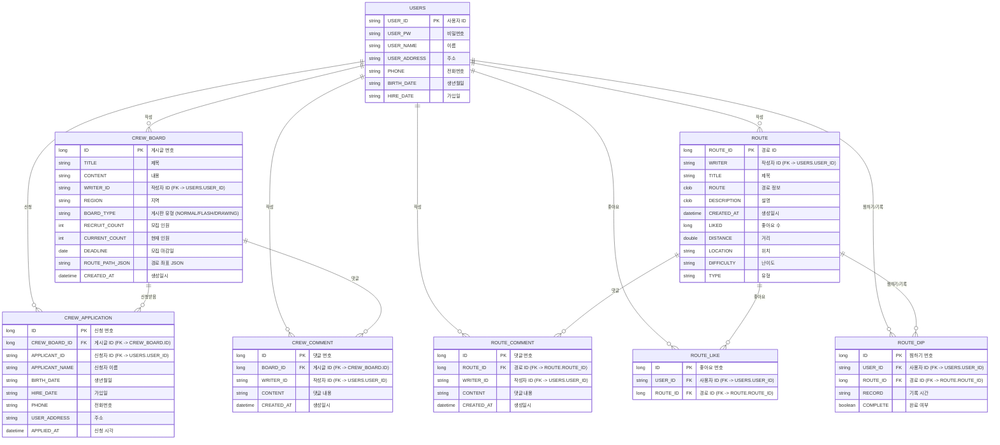

# E-R 다이어그램 (Entity-Relationship Diagram)

## 테이블 구조 상세

### USERS (사용자 테이블)
- **PK**: USER_ID
- 사용자 기본 정보를 저장하는 마스터 테이블
- 다른 모든 테이블에서 참조되는 중심 엔티티

### ROUTE (경로 테이블)
- **PK**: ROUTE_ID (시퀀스: Route_SEQ)
- **FK**: WRITER → USERS.USER_ID
- 러닝 경로 정보를 저장
- 경로 좌표, 거리, 난이도 등의 정보 포함

### CREW_BOARD (크루 게시판 테이블)
- **PK**: ID (AUTO_INCREMENT)
- **FK**: WRITER_ID → USERS.USER_ID
- 크루 모집 게시글 정보 저장
- BOARD_TYPE: NORMAL(일반), FLASH(번개), DRAWING(드로잉런)

### CREW_APPLICATION (크루 신청 테이블)
- **PK**: ID (AUTO_INCREMENT)
- **FK**: CREW_BOARD_ID → CREW_BOARD.ID
- **FK**: APPLICANT_ID → USERS.USER_ID
- 크루 모집 게시글에 대한 신청 정보 저장
- 신청자 정보를 복사하여 저장 (정규화되지 않은 구조)

### CREW_COMMENT (크루 댓글 테이블)
- **PK**: ID (AUTO_INCREMENT)
- **FK**: BOARD_ID → CREW_BOARD.ID
- **FK**: WRITER_ID → USERS.USER_ID
- 크루 게시판 댓글 정보 저장

### ROUTE_COMMENT (경로 댓글 테이블)
- **PK**: ID (AUTO_INCREMENT)
- **FK**: ROUTE_ID → ROUTE.ROUTE_ID
- **FK**: WRITER_ID → USERS.USER_ID
- 경로에 대한 댓글 정보 저장

### ROUTE_LIKE (경로 좋아요 테이블)
- **PK**: ID (AUTO_INCREMENT)
- **FK**: USER_ID → USERS.USER_ID
- **FK**: ROUTE_ID → ROUTE.ROUTE_ID
- 사용자가 경로에 좋아요를 누른 정보 저장
- 중복 좋아요 방지를 위한 유니크 제약 필요

### ROUTE_DIP (경로 찜하기/기록 테이블)
- **PK**: ID (시퀀스: Dip_SEQ)
- **FK**: USER_ID → USERS.USER_ID
- **FK**: ROUTE_ID → ROUTE.ROUTE_ID
- 사용자가 경로를 찜하거나 기록한 정보 저장
- RECORD: 기록 시간 (기본값: "00:00:00")
- COMPLETE: 완료 여부 (기본값: false)

## 관계 설명

1. **USERS → CREW_BOARD**: 한 사용자는 여러 게시글을 작성할 수 있음 (1:N)
2. **USERS → ROUTE**: 한 사용자는 여러 경로를 작성할 수 있음 (1:N)
3. **USERS → CREW_APPLICATION**: 한 사용자는 여러 크루에 신청할 수 있음 (1:N)
4. **USERS → CREW_COMMENT**: 한 사용자는 여러 댓글을 작성할 수 있음 (1:N)
5. **USERS → ROUTE_COMMENT**: 한 사용자는 여러 경로 댓글을 작성할 수 있음 (1:N)
6. **USERS → ROUTE_LIKE**: 한 사용자는 여러 경로에 좋아요를 누를 수 있음 (1:N)
7. **USERS → ROUTE_DIP**: 한 사용자는 여러 경로를 찜할 수 있음 (1:N)
8. **CREW_BOARD → CREW_APPLICATION**: 한 게시글에는 여러 신청이 올 수 있음 (1:N)
9. **CREW_BOARD → CREW_COMMENT**: 한 게시글에는 여러 댓글이 달릴 수 있음 (1:N)
10. **ROUTE → ROUTE_COMMENT**: 한 경로에는 여러 댓글이 달릴 수 있음 (1:N)
11. **ROUTE → ROUTE_LIKE**: 한 경로에는 여러 좋아요가 올 수 있음 (1:N)
12. **ROUTE → ROUTE_DIP**: 한 경로는 여러 사용자에게 찜될 수 있음 (1:N)

